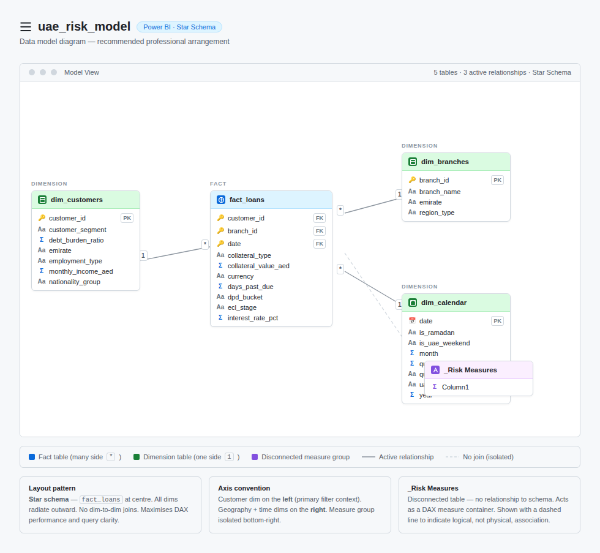
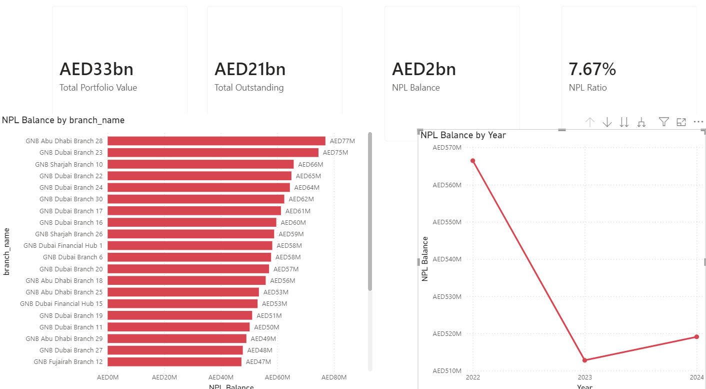

  
# 🏦 UAE Commercial Bank: Credit Risk & NPL Architecture

**An End-to-End Data Engineering & Business Intelligence Solution**

---

## 📌 The Pitch: Business Value First
In the financial sector, tracking **Non-Performing Loans (NPL)** isn't just about making charts—it is about risk mitigation and capital preservation. 

This project transforms raw, disconnected banking data into a **production-ready, cross-filtering analytical engine**. Designed with enterprise-grade data architecture, it allows banking executives to instantly isolate bad debt ratios down to the individual branch level, shifting credit risk management from reactive to proactive.

---

## 🏗️ The Engine: Data Architecture
> *Great executive dashboards are built on flawless backend data models.*

To ensure optimal query performance and highly scalable DAX calculations, the backend was strictly modeled using a **Star Schema** architecture. This establishes a single source of truth and prevents the performance bottlenecks common in flat-file reporting.

  

* 🧱 **Fact Table (`fact_loans`):** The quantitative core, tracking millions in loan amounts, outstanding balances, and risk provisions.
* 🌐 **Conformed Dimensions:** Dedicated lookups for `dim_branches`, `dim_customers`, and a robust time-intelligence calendar.
* 📂 **Semantic Layer (`_Risk Measures`):** A hollow, disconnected measure table housing all custom DAX logic (e.g., *NPL Ratio, Total Portfolio Value*) to keep the calculation engine organized and scalable.

---

## 📊 The Interface: Executive Dashboard
The frontend reporting layer was designed with a high-contrast, minimalist aesthetic to draw immediate attention to critical risk outliers. 

  

### 🔑 Key Features:
* **Dynamic Cross-Filtering:** Selecting a specific branch instantly recalculates all KPI cards and redraws the trend lines for that exact location.
* **Time Intelligence:** Year-over-year NPL tracking powered by the active calendar dimension relationship.
* **Actionable Insights:** Discovered and isolated a critical **10.88% NPL ratio** at specific Abu Dhabi branches against a portfolio average of 7.67%.

---

**Architected and engineered by Data With RISHAL**  
*Transforming raw data into strategic business assets.*

